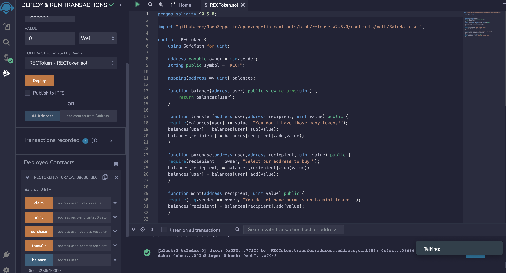
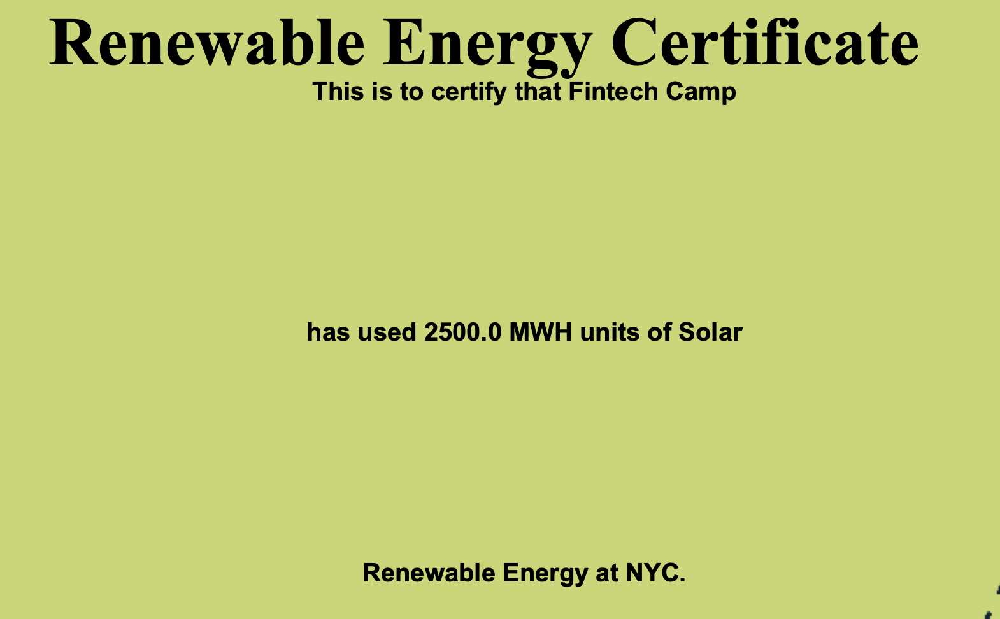
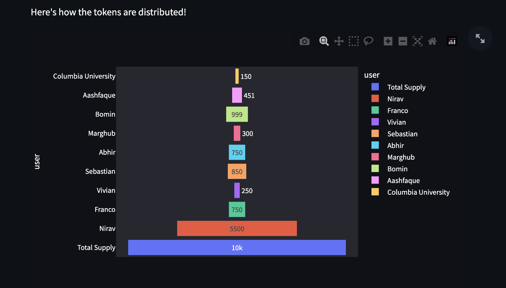

# REC_Token

___

## Renewable Energy Certificates Tokens - REC_Token

[Renewable Energy Certificates](https://www.epa.gov/green-power-markets/renewable-energy-certificates-recs) (REC) are a market-based instrument that certifies the bearer owns one megawatt-hour (MWh) of electricity generated from a renewable energy resource. The following link leads to a video by the US Environmental Protection Agency (EPA), explaining REC's in more detail - https://www.youtube.com/watch?v=_12VYXms6-c&ab_channel=U.S.EnvironmentalProtectionAgency.

This project involves tokenizing REC's, which not only facilitates trading REC but also includes a claim function that accounts for energy already utilized. This group selected a wind farm in Texas ([Astra Wind Farm](https://www.eia.gov/opendata/v1/qb.php?category=2611186&sdid=ELEC.PLANT.GEN.60856-WND-WT.M)) and used publicly available real monthly data to create our Beta version of the token. 
___

## Technologies

This project leverages Solidity and the RemixIDE:

* [Ganache](https://trufflesuite.com/ganache/) - a program that allows you to quickly set up a local blockchain, which you can use to test and develop smart contracts.

* [RemixIDE](https://remix-project.org/) - a powerful toolset for developing, deploying, debugging, and testing Ethereum and EVM-compatible smart contracts.

* [Streamlit](https://streamlit.io/) - an open-source Python library which enables developers to build attractive user interfaces.
___

## Usage

In order to run this program, one should open the RECToken.sol file in RemixIDE https://remix.ethereum.org/ and then compile it on version 0.5.0 and deploy it.

Next, copy the smart contract address and paste it into a .env file which also contains the following web3 provider URI "HTTP://127.0.0.1:7545".

Following this, one should navigate to the folder containing the python file, app.py and run this using the command; "Streamlit run app.py".
___

## Execution Results

### Ganache

### RemixIDE

### Streamlit

Ledger - The following image shows the transaction history on the Blockchain Ledger. It also includes the Block Inspector showing the information for a specific Block.

Claim Function - This image shows the input information to use the claim function, which removes the REC Tokens from circulation.

Certificate - This is the image of the Certificate generated when the claim function is executed.

Distribution - This image shows how the total supply of REC Tokens is distributed.

___

## Future Considerations

As this was a two week group project, there are several features that the group would have liked to include but given the time constraints, was not able to. As such, following is a list of functions that would be implemented given more time;

1. Exchange - This group could either start an exchange or work with an established exchange to accept REC Token's.
2. Government Regulations and Validation - As this involves energy usage, the US Environmental Protection Agency (EPA) and the Federal Energy Regulatory Commission (FERC) would need to be on board. As such, this group would need to lobby these agencies as well. Further, this group would consider future regulations regarding cryptocurrencies.
3. Supplier Software Adoption and Participation - As we would like REC Token's to replace Renewable Enegery Certificates, we would also need mass adoption by green energy producers. In particular, Wind, Solar, Hyrdo, and Geothermal Energy producers could utlize the token.
4. Automation - This project involved minimal actual data as the purpose was to put together a workable token. However, it is our long term goal to include real time data from energy producers in order to mint tokens monthly to the market. Additionally, there is a potential for different tokens based on the type of energy produced.
___
## Contributors

Abhir Mehra - abhirmehra5@gmail.com

Nirav Mehta - nm7293@gmail.com

Sebastian Sandoval - ssandoval1994r@gmail.com

Franco Thomas - francothomas1989@gmail.com

Vivian Yu - vyu@terpmail.umd.edu